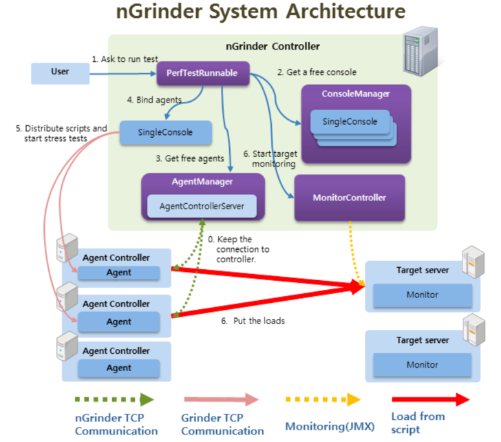
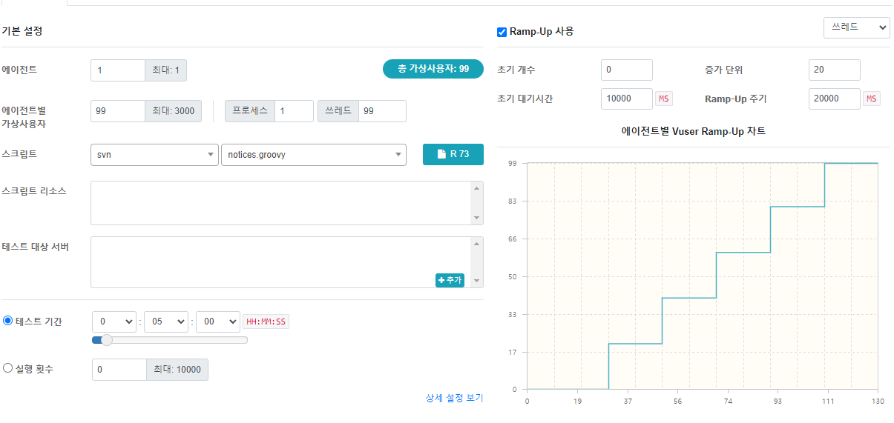
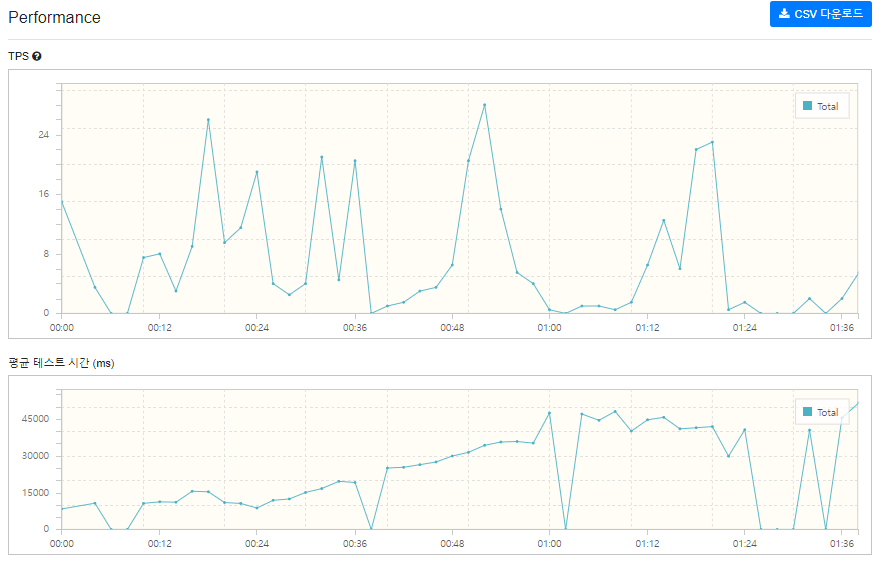
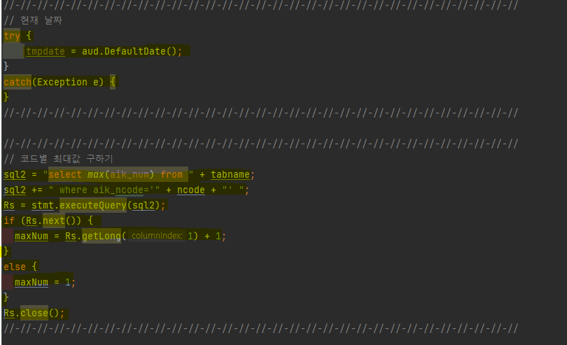
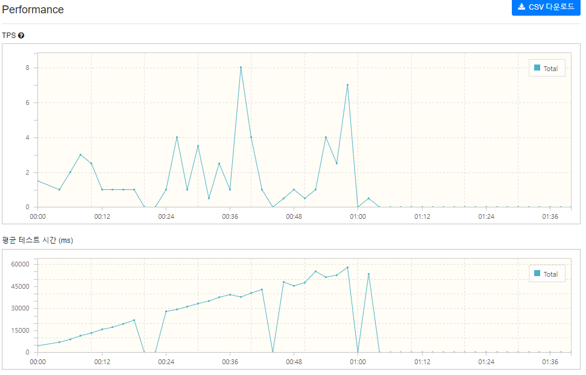

# nGridner
## nGridner란?
- web application을 배포하기 전에 해당 서비스가 어느정도의 성능을 버틸수 있는지 테스트 해보는 성능 테스트 도구다.

## 주요기능
- 스크립트 레코딩: 웹 브라우저에서 사용자 동작으로 녹화하여 테스트 스크립트를 생성할 수 있다.
- 분산 테스트: 다수의 에이전트 머신을 사용하여 대규모 테스트를 수행할 수 있다.
- 실시간 모니터링: 테스트 진행 중에 성능 지표를 실시간으로 모니터링 가능
- 분석 및 리포팅: 테스트 결과를 분석하고 리포트를 작성할 수 있다.

## 구조
<br>
0. agent와 ngrinder가 켜져 있는 상태
1. user가 작성한 test script를 run
2. run 하는 순간 consoleManager에서 single console 생성
   - single console이 테스트 스크립트와 여러 리소스들을 에이전트에 전달하고 관리하는 역활을 담당한다.
3. AgentControllerServer에서 필요한 수만큼 에이전트가 생성되고.
4. 생성된 에이전트와 single console이 합쳐진다
5. agent controller에서 test 진행
6. MonitorController에서 target server를 모니터링 해서 보여준다.

## 예시 (POST TEST)
- test 대상
  - koreatest.cric.kr
  - 공지사항 입력
- script
- 
- ```java
    @RunWith(GrinderRunner)
    class TestRunner {
    
        public static GTest test
        public static HTTPRequest request
        public static Map<String, String> headers = [:]
        public static Map<String, Object> params = [:]
        public static List<Cookie> cookies = []
    
        @BeforeProcess
        public static void beforeProcess() {
            HTTPRequestControl.setConnectionTimeout(300000)
            test = new GTest(1, "koreatest.cric.kr")
            request = new HTTPRequest()
    
            // Set header data
            headers.put("Content-Type", "application/x-www-form-urlencoded")
            grinder.logger.info("before process.")
        }
    
        @BeforeThread
        public void beforeThread() {
            test.record(this, "test")
            grinder.statistics.delayReports = true
            grinder.logger.info("before thread.")
        }
    
        @Before
        public void before() {
            request.setHeaders(headers)
            CookieManager.addCookies(cookies)
            grinder.logger.info("before. init headers and cookies")
        }
    
        @Test
        public void test() {
            params.put("s_0051_aik_ncode","a006")
            params.put("d_0051_aik_writedate","now()")
            params.put("s_0051_aik_userid","koreatest")
            params.put("_0000_aik_num","0")
            params.put("_0000_aik_ref","0")
            params.put("_0000_aik_step","0")
            params.put("_0000_aik_level","0")
            params.put("_0000_page","1")
            params.put("_0000_returl","/board/?ncode=a006&page=1")
            params.put("_0000_aik_html","2")
            params.put("s_0051_aik_username","nGrinder")
            params.put("s_0051_aik_useremail","joonsoung93@cricmail.net")
            params.put("s_0051_aik_title","성능 테스트")
            params.put("_0000_aik_top","2")
            params.put("s_0051_aik_content","성능 테스트 중입니다.")
            HTTPResponse response = request.POST("http://koreatest.cric.kr/servlet/Aik_Board_Insert", params)
    
            if (response.statusCode == 301 || response.statusCode == 302) {
                grinder.logger.warn("Warning. The response may not be correct. The response code was {}.", response.statusCode)
            } else {
                assertThat(response.statusCode, is(200))
            }
            request.GET("https://koreatest.cric.kr/board/?ncode=a006&page=1")
        }
    }
  
- 검증 결과
  - 
- 테스트 환경
  - 에이전트 : 1
  - 가상 사용자 : 396
  - 프로세스 : 8
  - 스레드 : 37
  - Ramp-Up : 사용
  - 테스트 기간 : 2분

- 결과
  - 
- 리펙터링
  - 
- 리펙터링 후 테스트 결과
  - 
